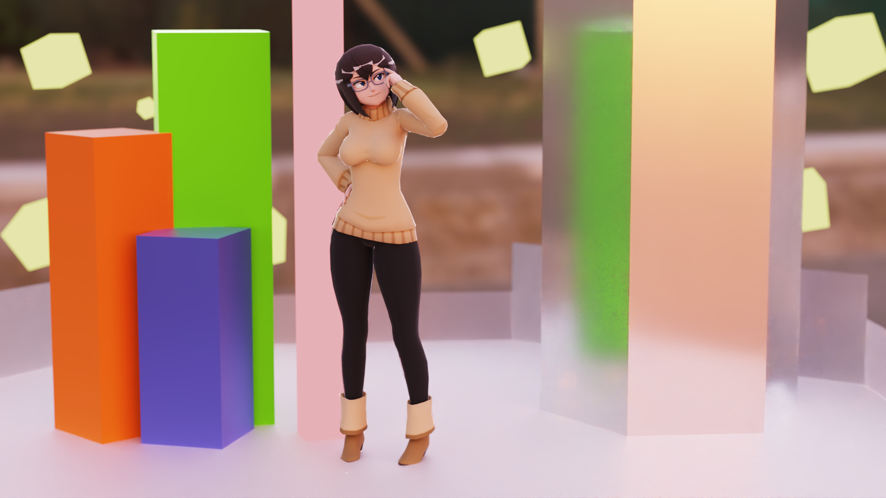
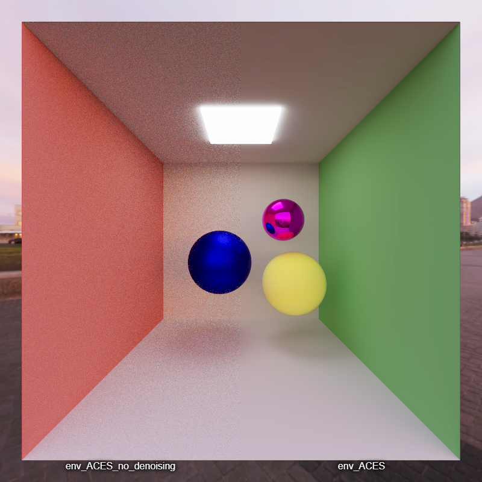
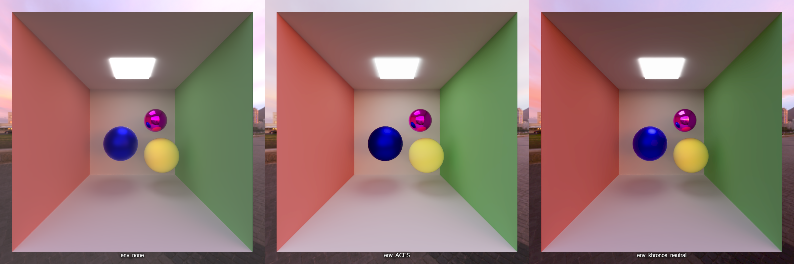
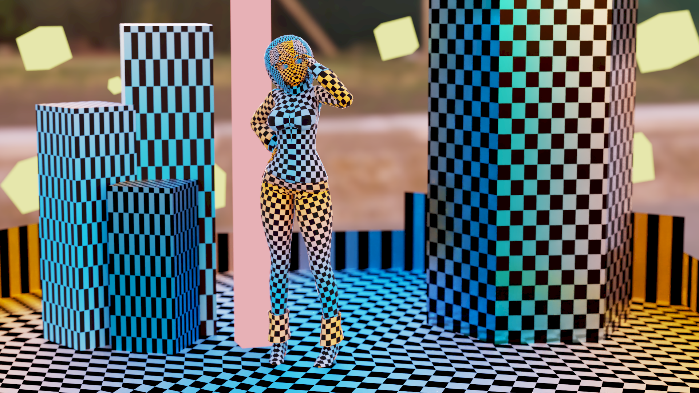
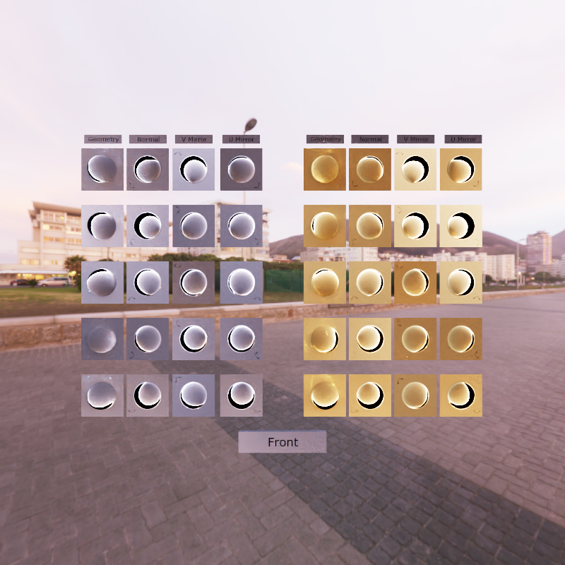
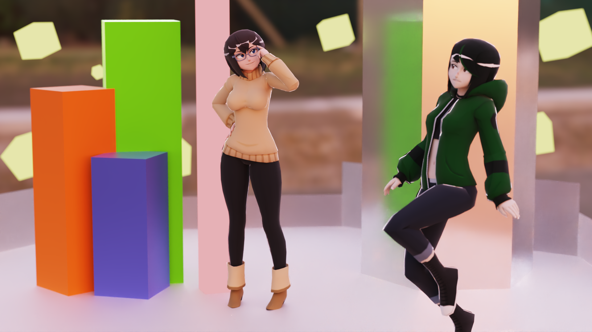
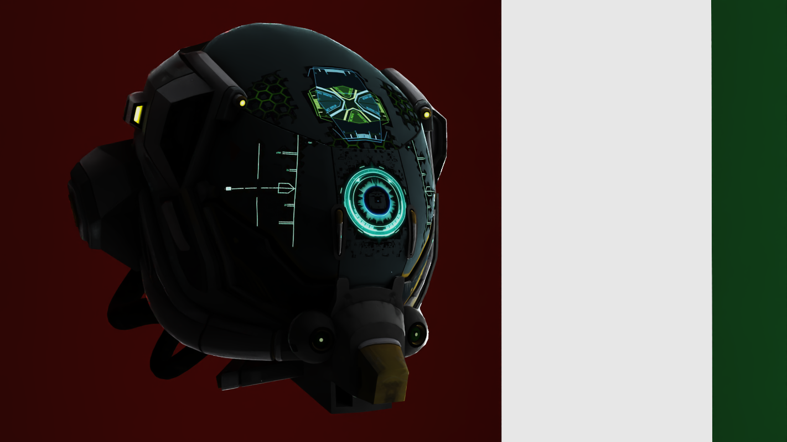

CUDA Path Tracer
================

**University of Pennsylvania, CIS 565: GPU Programming and Architecture, Project 3**

* Aaron Tian
  * [LinkedIn](https://www.linkedin.com/in/aaron-c-tian/), [personal website](https://aarontian-stack.github.io/)
* Tested on: Windows 22H2 (26100.6584), Intel Core Ultra 7 265k @ 3.90GHz, 32GB RAM, RTX 5070 12GB (release driver 581.15)

## Summary

A Monte-Carlo path tracer implemented using C++, CUDA, and Vulkan. Rays are traced using CUDA and a progressive render along with controls is displayed using Vulkan.



<table>
<tr>
<td width="50%"></td>
<td width="50%"></td>
</tr>
</table> 

## Features

### Visual Features

* [Specular Microfacet Model](#specular-microfacet-model)
* [Stochastic Sampled Antialiasing](#stochastic-sampled-antialiasing)
* [Environment Map Lighting](#environment-map-lighting)
* [OptiX Denoiser](#optix-denoiser)
* [Tone Mapping Filters](#tone-mapping-filters)
* [glTF Loading with Texture Mapping](#gltf-loading-with-texture-mapping)
* [Physically-based DOF](#physically-based-dof)

### Performance Features

* [CUDA-Vulkan Interop using Vulkan 1.3](#cuda-vulkan-interop-using-vulkan-13)
* [Stream Compaction](#stream-compaction)
* [Material Sorting](#material-sorting)
* [Bounding Volume Intersection](#bounding-volume-intersection)
* [Switching Path Segments to Struct of Arrays](#switching-path-segments-to-struct-of-arrays)

## Build and Run

This project uses CMake and is **Windows only**. Example build steps after cloning the repo and entering the root directory:

```bash
mkdir build
cd build
cmake ..
cmake --build . --config Release
```

You should generate a Visual Studio project and build using MSBuild. You will need to have the CUDA toolkit installed and a working Vulkan driver. You should **not** need the Vulkan SDK to be installed in order to build or run the app.

Note that the included scene files expect the working directory to be a direct subdirectory of the root directory.

**The app does not work with driver 581.42** due to an issue with CUDA-Vulkan interop. Try using an older driver if the app fails to run.

Example usage, assuming the build directory inside the root is the working directory (use `-h` to see more options):

```bash
cis565_path_tracer.exe ../scenes/cornell.json
```

## Feature Details

### Visual Features

#### Specular Microfacet Model

I use the Frostbite microfacet shading model as described in the course ["Moving Frostbite to Physically Based Rendering 3.0"](https://seblagarde.wordpress.com/wp-content/uploads/2015/07/course_notes_moving_frostbite_to_pbr_v32.pdf) from SIGGRAPH 2014. It consists of:
* Specular Term: Torrance-Sparrow microfacet model using Trowbridge-Reitz (GGX) normal distribution function, Schlick's approximation for the Fresnel term, and Smith's method for the geometric attenuation term.
* Diffuse Term: Disney diffuse term from Disney BRDF.

This allows for representing materials using "roughness" and "metallic" parameters.

<div align="center">
  
  <p>Spheres of varying roughness.</p>
</div>

This model is essentially a kind of uber shader or material, good for representing surfaces from plastic to metal, and is used for all objects in the scene. I chose this model because it fits well with the base glTF material format, which we'll see in a later section. Performance-wise, this is obviously more expensive than a simple Lambertian diffuse model. We incur many more floating point operations, mild branching, and transcendental functions (pow, sqrt, etc.). Deciding to use the specular or diffuse reflectance vector in the probability weighting is determined by a random number with the metallic parameter as a threshold. 

#### Stochastic Sampled Antialiasing

To reduce aliasing (jagged edges), the rays in each sample iteration can be jittered by introducing random offsets to their direction. This stochastic sampling technique averages aliasing over multiple frames, resulting in smoother edges.


This is a pretty simple and cheap way to improve image quality. Looking at the logic:

```C++
thrust::default_random_engine rng = make_seeded_random_engine(iter, index, traceDepth);
thrust::uniform_real_distribution<float> u01(0, 1);

glm::vec3 pixel_dir = glm::normalize(cam.view
    - cam.right * cam.pixel_length.x * (static_cast<float>(x) - static_cast<float>(cam.resolution.x) * 0.5f + u01(rng))
    - cam.up * cam.pixel_length.y * (static_cast<float>(y) - static_cast<float>(cam.resolution.y) * 0.5f + u01(rng))
);
```

Performance-wise, all we do is pick two random numbers between 0 and 1 and add them to the ray direction. The only thing that could be optimized is the random number generation.

#### Environment Map Lighting

Whenever a ray does not intersect with any geometry, we can sample an environment map to get a background or ambient color which can really improve the lighting in our scenes, especially those that are supposed to be outdoors. An HDRI file can be used to provide these lighting values. Although the HDRI is a rectangular 2D image, it is actually a spherical projection that maps to a full 360-degree environment. We can convert a 3D direction vector to 2D texture coordinates using spherical mapping to sample the color from the HDRI.

<div align="center">
  
  <p>Environment mapped Cornell box. Note the output is denoised.</p>
</div>

Looking at the environment mapping logic:

```C++
glm::vec3 dir = glm::normalize(ray.direction);
float u = atan2(dir.z, dir.x) / (2.0f * PI) + 0.5f;
float v = acos(dir.y) / PI;
float4 hdri_color = tex2D<float4>(hdri, u, v);
color *= glm::vec3(hdri_color.x, hdri_color.y, hdri_color.z) * pow(2.0f, exposure);
```

Performance-wise, we need to do a couple transcendental functions, a texture sample, and an exponent. So although it's a simple operation, it is not the cheapest. This could be optimized by loading the environment map as a cubemap texture instead, so that this UV conversion can be done in hardware, but this will require loading a cubemap texture from disk.

#### OptiX Denoiser

One sample is just a small portion of the full integral in the rendering equation, so our visual result has noise that decreases as we take more samples. However, many samples are needed to produce a clean image. To speed up convergence, I use the [NVIDIA OptiX denoiser](https://developer.nvidia.com/optix-denoiser) which removes noise from the image using a machine learning model. Note that the previous renders you have seen up to this point are all denoised. 

<div align="center">
  
  
  <table>
  <tr>
  <td width="50%"></td>
  <td width="50%"></td>
  </tr>
  </table>
  
  <p>Side-by-side comparison with and without denoising, rendered with 5000 samples.</p>
</div>

Given the same number of samples, the denoised image is much cleaner. The denoiser takes in the albedo and normal buffers of the image as auxiliary inputs to help it better preserve edges and details. Since I only denoise the image when the option is selected in the preview menu or when the desired number of samples is reached and the render is saved to disk, I consider this to be a purely visual feature rather than a performance feature. When viewing the denoised image in the preview, the image is denoised every set number of iterations (not every frame).

<table>
<tr>
<td width="50%"></td>
<td width="50%"></td>
</tr>
</table>

*Albedo and normal inputs. Note that the normal is the raw floating point value, which is why the right side is black (negative value).*

Denoising itself appears to be a fast operation, as seen in the Nsight timings below, so you should not expect it to significantly impact performance per frame with it enabled in the preview.

<div align="center">
  
  <p>Denoiser kernel durations. Combined, these add up to 0.14 ms.</p>
</div>

#### Tone Mapping Filters

Our rendered image is potentially HDR, meaning pixel values can exceed the usual 0 to 1 range we expect in a regular RGB image. Tone mapping addresses this by mapping the high dynamic range to the 0 to 1 range suitable for a standard image. I implement two tone mapping operators: ACES Filmic and PBR Neutral.

<div align="center">
  
  <p>Side by side comparison of tone mapping outputs. Gamma correction is applied to all outputs.</p>
</div>

Tone mapping operators are implemented as a separate kernel that runs on the preview image or when the render is saved to disk, so the accumulation render buffer is unaffected. We read the input color, do simple floating point operations, and then write out the tone-mapped color. It is a very simple operation, so there is not really any room for performance improvement here within the kernel.

#### glTF Loading with Texture Mapping

Ideally, it would be nice to look at something more interesting than spheres in a Cornell box. We can solve this by loading [glTF](https://www.khronos.org/gltf/) files using the [tinygltf](https://github.com/syoyo/tinygltf) library. I directly dump the raw data (buffers, accessors, textures, materials, etc.) from tinygltf into CUDA buffers/textures with little to no pre-processing on the CPU. Triangle data is dynamically parsed inside the CUDA kernel using the raw buffers. To determine triangle ray intersections, I use the [Möller–Trumbore intersection algorithm](https://en.wikipedia.org/wiki/M%C3%B6ller%E2%80%93Trumbore_intersection_algorithm). Currently, I iterate over every triangle in the mesh per ray, but there is an optimization using a [bounding volume intersection](#bounding-volume-intersection). Vertex attributes are interpolated across the triangle using barycentric coordinates for normals and texture coordinates. 

The glTF format uses PBR materials based on the roughness and metallic specular model. This fits perfectly with the shading model I implemented. Materials can have a texture map and a constant value for albedo, roughness/metallic, normal map, and emission. If these texture maps are present, they are used during shading.

I also use the camera defined in the glTF file if it exists. This lets me easily frame scenes in a 3D modeling program such as Blender and export them for use in my path tracer.

<div align="center">
  
  <p>Complex triangle mesh robot model with PBR materials.</p>
</div>

I also implemented a procedural checkerboard texture combined with a cosine color curve that can be enabled to replace the albedo texture of all materials. This is enabled using the `PROCEDURAL_TEXTURE` macro. Performance-wise, this replaces a texture read with a few simple arithmetic operations, so it should be cheaper than reading from memory.

<div align="center">
  
  <p>Procedural checkerboard texture with cosine color curve.</p>
</div>

<div align="center">
  
  <p>Normal map example.</p>
</div>

#### Physically-based DOF

Depth of Field (DOF) is a camera effect that simulates the way real cameras focus on subjects at certain distances while blurring out others. I implement the thin lens model to achieve this effect. Rays are traced from a point on an infinitely thin circular "lens" and then oriented towards a point on the focal plane. The radius of the lens is determined by the desired angle of the cone formed by the camera position and the focus distance.

<div align="center">
  
  <p>DOF example. Notice how the figures in the back are blurrier.</p>
</div>

This is a simple and cheap way to make renders look more interesting. Looking at the logic:

```C++
float defocus_angle = glm::max(0.0f, cam.defocus_angle);

float defocus_radius = cam.focus_distance * tan(glm::radians(defocus_angle / 2.0f));
glm::vec3 defocus_disk_u = cam.right * defocus_radius;
glm::vec3 defocus_disk_v = cam.up * defocus_radius;

glm::vec2 rd_sample = glm::vec2(u01(rng), u01(rng));
glm::vec3 rd = random_in_unit_disk(rd_sample);
glm::vec3 offset = rd.x * defocus_disk_u + rd.y * defocus_disk_v;

origin = cam.position + offset;
glm::vec3 point_on_focal_plane = cam.position + cam.focus_distance * pixel_dir;
direction = glm::normalize(point_on_focal_plane - origin);
```

Performance-wise, all we do is pick a random point in the disk, compute a tangent, and do some vector math.

### Performance Features

All scenes are rendered at 800p resolution, with a trace depth of 4. Stream compaction and Bounding Volume Intersection is enabled unless otherwise noted. 

#### CUDA-Vulkan Interop using Vulkan 1.3

The preview image is displayed using Vulkan. A texture in Vulkan is allocated, to which CUDA essentially copies the current accumulated image divided by the current number of iterations to using a dedicated CUDA kernel. The texture is accessed by CUDA by importing it as an external memory object. This texture is blitted to the swapchain image for display, then the ImGui interface is drawn using the dynamic rendering extension. 

To synchronize access to the texture between CUDA and Vulkan, such that CUDA finishes writing to the texture before Vulkan uses it, a Vulkan semaphore is similarly exported as an external semaphore object such that CUDA can signal it after pathtracing kernels are complete. Vulkan rendering work waits on this semaphore before blitting the texture and drawing ImGui.

The app queues two frames in flight. Each frame, the CPU signals a timeline semaphore with an expected incrementing value for when that frame is ready to be reused (when the blit and ImGui draw for that frame is done). If the current frame value is less than the expected value, the CPU waits on the timeline semaphore until it reaches that value before reusing the frame. This ensures that the GPU has finished rendering that frame before we reuse its resources (command pool, binary semaphores for acquiring swapchain image, etc.). The timeline semaphore saves us from having to use one VkFence per frame.

Performance-wise, this GPU side CUDA-Vulkan synchronization theoretically should be faster than forcing the CPU to wait for CUDA to finish before proceeding with Vulkan rendering (`cudaDeviceSynchronize`). The CPU *should* be able to queue work more quickly this way, but in practice I doubt there will be a large difference due to the long time the CUDA kernels take to execute (overall frame will be very long).

Basic performance comparison I did:


I changed quite a lot during the rewrite of the base code, so this is not an apples-to-apples comparison. In addition, I am only able to test with the Cornell box scene because I added many of the path tracer's features such as glTF loading after switching to Vulkan. I would take the above graph with a large grain of salt. In general, this app is not CPU limited so I would not expect major gains from using Vulkan, if any at all.

#### Stream Compaction

In a naive GPU path tracer, terminated rays (those that have reached a light source, entered the void, or exceeded the maximum trace depth), are still processed in future iterations even though there is no more work to be done. We should not be launching threads for these rays at all. Stream compaction (technically partition) solves this issue by moving terminated rays to the end of the ray buffer array such that we only launch threads for the still active rays in the front of the array. 


We get a nice improvement in the more complex scenes (which also happen to all be open scenes). The Cornell box does not see the same benefit most likely because it is a closed scene (the walls cover all sides and a large portion of the view). Rays are less likely to escape into the void or reach a light and thus end early, so most rays are still active until the maximum trace depth is reached. Thus the partition is not able to cull as many rays.

#### Material Sorting

Another possible "optimization" is to sort the rays by material ID before running the shading kernel. This should improve memory coherence when accessing the materials buffer. However in practice this does not really work:


In every scene material sorting makes performance worse, especially in the simple Cornell box scene. This is likely because the overhead of sorting an especially small number of materials outweighs any potential gains from better memory coherence. 

#### Bounding Volume Intersection

When rendering triangle models, we normally would iterate over every single triangle whenever a ray does an intersection. However, we can skip testing against certain groups of triangles entirely by enclosing them in a bounding volume (a box). For each primitive in the glTF mesh, a bounding box is calculated for use in the intersection kernel. When a ray is traced, we first test for intersection against the bounding box. If there is no intersection, we skip testing against all triangles in that primitive. If there is an intersection, we then test against all triangles in that primitive as normal.


This simple optimization makes a large difference in most of the above tested scenes. In the robot scene there is not a large improvement. This is likely because the robot model takes up a large portion of the view which will cause most initial rays to intersect with the bounding box. Ideally, threads within a warp are coherent: an entire warp of rays should either all intersect or all miss the bounding box. If we were to repeat this bounding box scheme recursively based on the triangles in the mesh, we could build a BVH (bounding volume hierarchy) which would yield even better improvements.

#### Switching Path Segments to Struct of Arrays

I switched the path segment struct to a struct of arrays to improve memory coalescing when accessing the ray data:

```C++
// NEW 
struct PathSegments
{
    glm::vec3* origins;
    glm::vec3* directions;
    glm::vec3* colors;
    int* pixel_indices;
    int* remaining_bounces;
};
// OLD
struct Ray
{
    glm::vec3 origin;
    glm::vec3 direction;
};
struct PathSegment
{
    Ray ray;
    glm::vec3 color;
    int pixelIndex;
    int remainingBounces;
};
```
The reasoning for this was because I noticed segment data was always accessed in a strided manner (only one member of the struct at a time). In the original shading and gather kernel (which is where segments are accessed the most) the only attribute we read is the color:

```C++
__global__ void shadeFakeMaterial(
    int iter,
    int num_paths,
    ShadeableIntersection* shadeableIntersections,
    PathSegment* pathSegments,
    Material* materials)
{
...
        ShadeableIntersection intersection = shadeableIntersections[idx];
        ...
            if (material.emittance > 0.0f) 
            {
                pathSegments[idx].color *= (materialColor * material.emittance);
            }
            else 
            {
                ...
                pathSegments[idx].color *= (materialColor * lightTerm) * 0.3f + ((1.0f - intersection.t * 0.02f) * materialColor) * 0.7f;
                pathSegments[idx].color *= u01(rng); // apply some noise because why not
            }
        ...
        else 
        {
            pathSegments[idx].color = glm::vec3(0.0f);
        }
    }
}
```

```C++
__global__ void finalGather(int nPaths, glm::vec3* image, PathSegment* iterationPaths)
{
...
        PathSegment iterationPath = iterationPaths[index];
        image[iterationPath.pixelIndex] += iterationPath.color;
...
}
```

This translates to a small but noticeable performance improvement:


The time saved per sample is very small (~0.3 ms), but it adds up over time.

## Dependencies

- [argparse](https://github.com/p-ranav/argparse) - MIT License
- [GLM](https://github.com/g-truc/glm) - MIT License
- [Dear ImGui](https://github.com/ocornut/imgui) - MIT License
- [NVIDIA OptiX](https://developer.nvidia.com/optix) - Nvidia Proprietary License
- [SDL](https://github.com/libsdl-org/SDL) - zlib License
- [tinygltf](https://github.com/syoyo/tinygltf) - MIT License
- [vk-bootstrap](https://github.com/charles-lunarg/vk-bootstrap) - MIT License
- [volk](https://github.com/zeux/volk) - MIT License
- [Vulkan Headers](https://github.com/KhronosGroup/Vulkan-Headers) - Apache 2.0 License

## References

- [Moving Frostbite to Physically Based Rendering](https://seblagarde.wordpress.com/wp-content/uploads/2015/07/course_notes_moving_frostbite_to_pbr_v32.pdf)
 - Adam Mally's CIS 5610 Course
   - [Physically Based Rendering](https://www.pbrt.org/)
- [Ray Tracing in One Weekend](https://raytracing.github.io/books/RayTracingInOneWeekend.html)
- [Möller–Trumbore intersection algorithm](https://en.wikipedia.org/wiki/M%C3%B6ller%E2%80%93Trumbore_intersection_algorithm)
- [ACES Filmic Tone Mapping Curve](https://knarkowicz.wordpress.com/2016/01/06/aces-filmic-tone-mapping-curve/)
- [PBR Neutral Tone Mapping](https://github.com/KhronosGroup/ToneMapping/blob/main/PBR_Neutral/pbrNeutral.glsl)
- [Color palettes by Inigo Quilez](https://iquilezles.org/articles/palettes/)
- [CUDA-Vulkan VkImage Interop Forum Post](https://forums.developer.nvidia.com/t/cuda-vulkan-vkimage-interop/278691)
- [NVIDIA CUDA Samples](https://github.com/NVIDIA/cuda-samples/tree/master/Samples/5_Domain_Specific/vulkanImageCUDA)

## Extra Renders

A couple extra renders.




## Model Credits

- [Polly Low Poly Anime Character](https://sketchfab.com/3d-models/polly-low-poly-anime-character-66872127cde644d687fd25bd9e7a70f9)
- [Serena Low Poly Character](https://sketchfab.com/3d-models/serena-low-poly-character-8c5ebd6a05bd4afcbdbf9a6e5dfa1d13)
- [Lowpoly People](https://sketchfab.com/3d-models/freebie-lowpoly-people-3c57a85ef5464aa7973f466383d69c48)
- [Robot](https://sketchfab.com/3d-models/robot-435566387be94cbfbc623c3d45241769)
- [NormalTangentMirrorTest](https://github.com/KhronosGroup/glTF-Sample-Models/tree/main/2.0/NormalTangentMirrorTest)
- [DamagedHelmet](https://github.com/KhronosGroup/glTF-Sample-Models/tree/main/2.0/DamagedHelmet)
